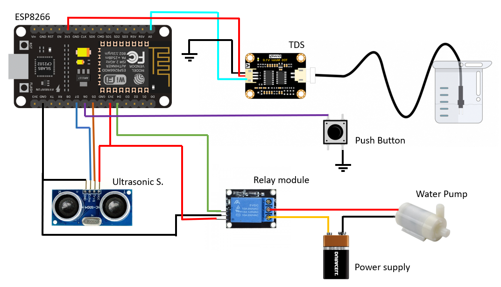

# 🌊 AquaTrack: Smart Water Level & Purity Monitoring System   

## 📌 Abstract  
Water conservation and quality assessment are critical for sustainable development. **AquaTrack** is an **IoT-powered water management system** that enables **real-time monitoring** of **water levels and purity**. It integrates **NodeMCU ESP8266**, **Ultrasonic Sensor**, and **TDS Sensor** to automate water management.  

By utilizing **Blynk App**, users can remotely monitor and control water levels and receive **instant alerts** on water purity. This system is beneficial for **domestic, industrial, and agricultural** water management.  

---

## 🛠️ Features  
- 📡 **Real-time water level monitoring** using an **Ultrasonic Sensor**.  
- 💧 **Water purity assessment** using a **TDS (Total Dissolved Solids) Sensor**.  
- ⚡ **Automatic water pump activation** based on threshold levels.  
- 📲 **Remote monitoring & control** via the **Blynk App**.  
- 🔔 **Instant alerts & notifications** for critical water conditions.  
- 🌱 **Energy-efficient automation** for water conservation.  
- 📈 **Data visualization** with IoT cloud integration.  

---

## 🔩 Hardware Components  
- **NodeMCU ESP8266** – WiFi-enabled microcontroller  
- **Ultrasonic Sensor (HC-SR04)** – Water level detection  
- **TDS Sensor** – Water purity measurement  
- **Motor Pump & Relay Module** – Automatic water control  
- **Power Supply (5V/12V)**  
- **Jumper Wires & Breadboard**

 

---

## 💻 Software & Tools  
- **Arduino IDE** – Programming the NodeMCU  
- **Blynk App** – Remote control & monitoring  
- **ESP8266 Library** – WiFi communication  
- **ThingSpeak (Optional)** – Data storage & visualization  

---

## 🚀 Installation & Setup Guide  

### **1️⃣ Hardware Setup**  
1. **Connect the Ultrasonic Sensor** to measure water levels.  
2. **Integrate the TDS Sensor** for water quality monitoring.  
3. **Connect the Relay Module & Motor Pump** for automated water control.  
4. **Power the NodeMCU ESP8266** and ensure WiFi connectivity.  

### **2️⃣ Software Setup**  
1. **Install Arduino IDE** and add the ESP8266 Board:  
   - Open **Arduino IDE** > Go to **Preferences** > Add this URL:  
     ```
     http://arduino.esp8266.com/stable/package_esp8266com_index.json
     ```
   - Open **Boards Manager** and install **ESP8266**.  
   - Install the required libraries:  
     ```bash
     ESP8266WiFi
     BlynkSimpleEsp8266
     Ultrasonic
     ```

2. **Upload the Code**  
   - Open `final_cp.ino` in **Arduino IDE**.  
   - Update **WiFi credentials** and **Blynk authentication key** in the code.  
   - Select **NodeMCU 1.0 (ESP8266)** as the board.  
   - Upload the code to the NodeMCU.  

---

## 📲 Setting Up Blynk App  

### **Step 1: Install Blynk**  
Download the **Blynk App** from:  
- 📱 [Android](https://play.google.com/store/apps/details?id=cc.blynk)  
- 📱 [iOS](https://apps.apple.com/app/blynk-iot/id808968640)  

### **Step 2: Create a New Project**  
1. Open **Blynk App** and create a new account (or log in).  
2. Tap **"New Project"**, give it a name (e.g., **AquaTrack**).  
3. Select **NodeMCU** as the device.  
4. Choose **WiFi** as the connection type.  
5. Tap **"Create"** – You will receive an **Auth Token** via email.  

### **Step 3: Add Widgets**  
1. **Water Level Display**:  
   - Tap **“+”** to add a **Gauge Widget**.  
   - Set **V1 (Virtual Pin 1)** as the data source.  
   - Label it as **"Water Level"** and set the range (e.g., 0-100%).  

2. **Water Purity Display (TDS Sensor)**:  
   - Tap **“+”** to add another **Gauge Widget**.  
   - Set **V2 (Virtual Pin 2)** as the data source.  
   - Label it as **"Water Purity (TDS)"** and set the range (e.g., 0-1000 ppm).  

3. **Pump Control (Manual Mode)**:  
   - Tap **“+”** to add a **Button Widget**.  
   - Set it to **V3 (Virtual Pin 3)**.  
   - Change the mode to **Switch** (ON/OFF).  
   - Label it as **"Pump Control"**.  

4. **Notifications & Alerts**:  
   - Tap **“+”** to add a **Notification Widget**.  
   - This will be triggered when water level is low or water quality is poor.  

5. **Real-Time Data Chart** (Optional):  
   - Tap **“+”** to add a **SuperChart Widget**.  
   - Set V1 (Water Level) and V2 (Water Purity) as data sources.  
   - Enable real-time graphing to visualize trends.  

### **Step 4: Connect Blynk with NodeMCU**  
1. Copy the **Auth Token** from your email.  
2. Paste the token in your **Arduino Code** under:  
   ```cpp
   #define BLYNK_AUTH_TOKEN "Your_Auth_Token_Here"

